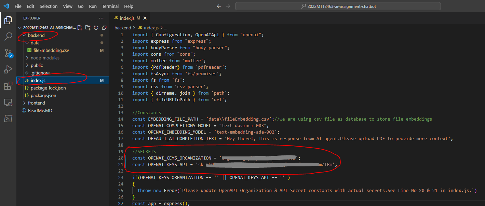
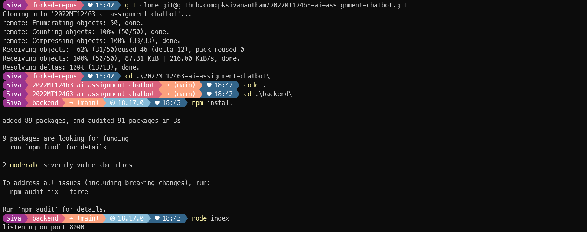
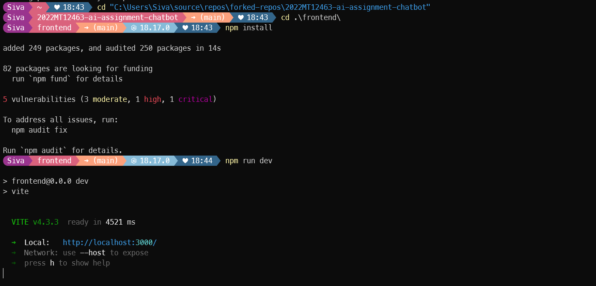
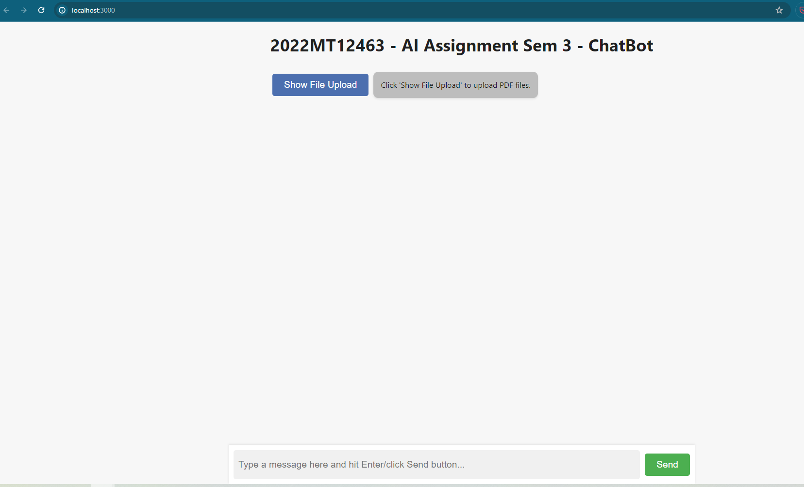
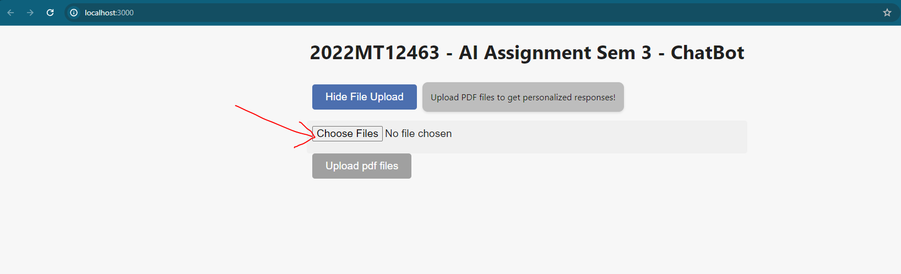
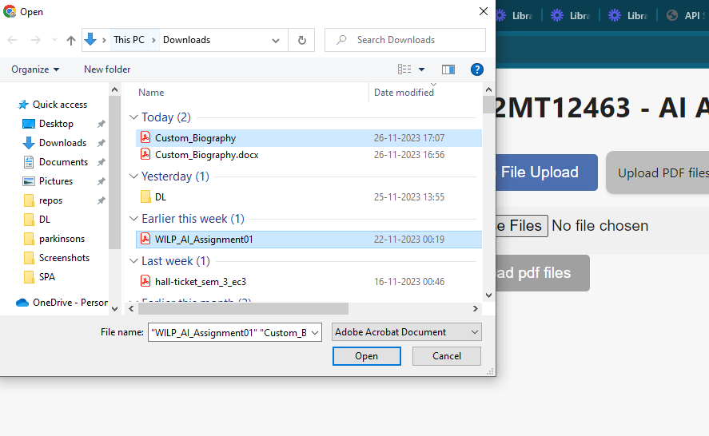
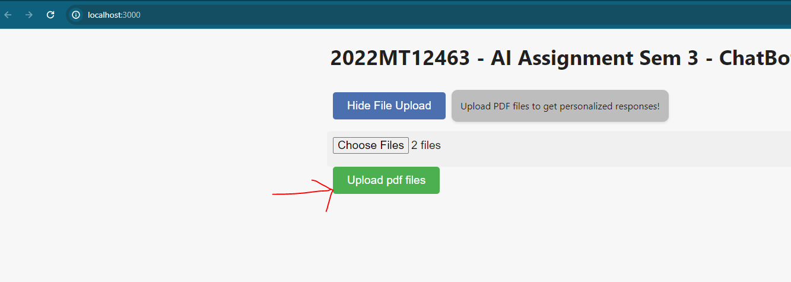
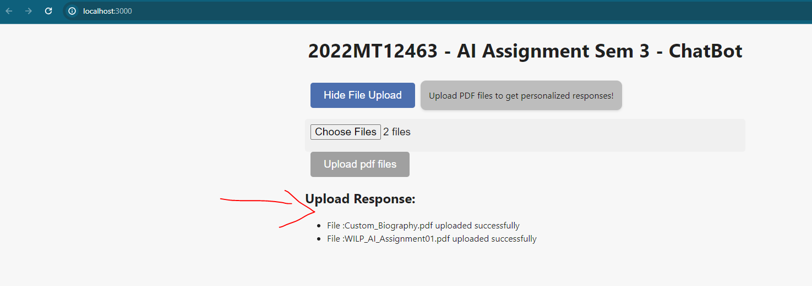
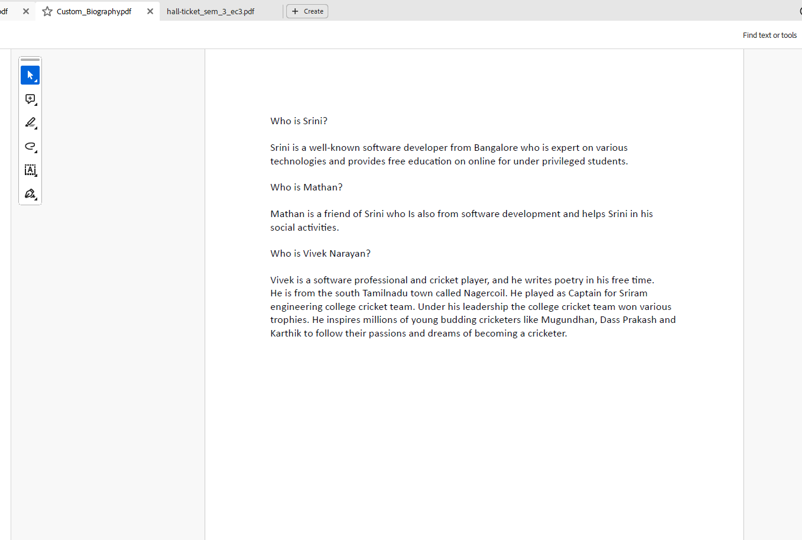
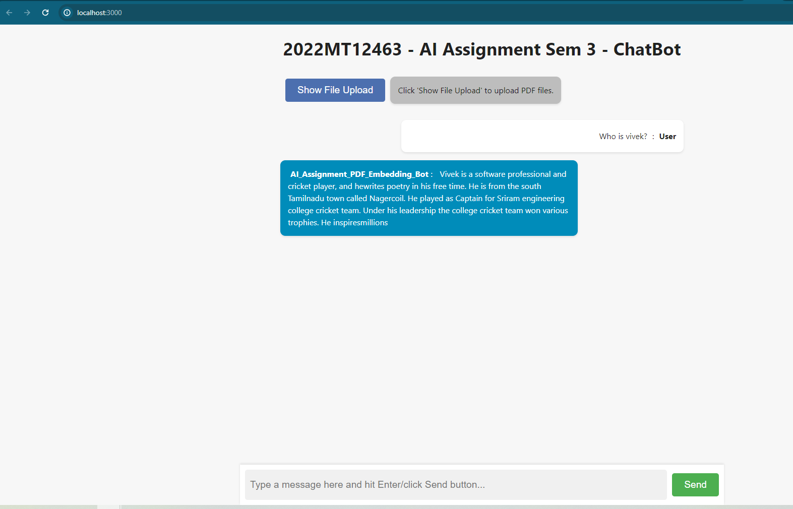

## Assignment Info
* IS/SE/SS ZC444: Artificial Intelligence
* Assignment-01: Custom AI Chatbot Using LLM
* Student Id: 2022MT12463
* [Demo video link url](https://www.loom.com/share/345a28edcbe142c9b61fab9d78e8aac4?sid=e33efef0-5752-4772-b189-6d08e6fc7cef) 
* [Github repo link](https://github.com/pksivanantham/2022MT12463-ai-assignment-chatbot)

# Key items considered in project
* Database to store file embedding
    * we are using csv file as database to store file embeddings
    * It will be stored under `backend\data\fileEmbedding.csv`
    * It contain two columns: `Text`,`Embedding`
* Models used for OpenAI API request:
    * Embedding : `text-embedding-ada-002`
    * Chat completion : `text-davinci-003`

## Dependencies
### Backend
* [OpenAI](https://openai.com/)
* [ChatGPT](https://platform.openai.com/)
* [Nodejs](https://nodejs.org/en)

### Frontend
* [React](https://react.dev/)
* [Vite](https://vitejs.dev/)

# Installation
* Unzip the '2022MT12463-ai-assignment-chatbot'

### 1. Update OpenAPI Secrets :
* Navigate into the folder `cd 2022MT12463-ai-assignment-chatbot`
* Navigate into the `backend` folder `cd backend`
* Open file `index.js`
* Navigate to line 21 and update the following secret constants
    * `OPENAI_KEYS_ORGANIZATION` : Organization key from OpenAPI
    * `OPENAI_KEYS_API` : API key from OpenAPI
     
### 2. API Server :
* Navigate into the folder `cd 2022MT12463-ai-assignment-chatbot`
* Navigate into the `backend` folder `cd backend`
* Install the dependencies ``npm install``
* Run the `index.js` file `node index`
 

*That will start the backend server on port `8000`: http://localhost:8000/*
### 3. Chatbot WebApp :
* Navigate into the folder `cd 2022MT12463-ai-assignment-chatbot`
* Navigate into the `frontend` folder `cd frontend`
* Install the dependencies ``npm install``
* Start the local server ``npm run dev``
 
*That will open the UI project on your default browser: http://127.0.0.1:3000/. You can now chat with our custom AI Chatbot from your browser*

# Instruction to use the chatbot
* Navigate to Chatbot from your browser: http://localhost:3000/
* We have to upload pdf files to get custom context response based on the pdf file content. Otherwise chatbot will provide random response
* Follow the below instruction 1 and 2
 
### 1. How to upload pdf files:
* Navigate to Chatbot from your browser: http://localhost:3000/
* Click on the 'Show File Upload' Button
* Click on 'Choose the file' button to browse files
* Select 1 or more pdf files
* Click on 'Upload pdf files' button to upload the files to server
* Once file uploaded successfully.Response will be displayed below the 'Upload pdf files' button.
* Once upload is done. You can click on the 'Hide File Upload' Button to hide the upload content section
 
 
 
 
 
### 2. How to use Chatbot:
* Navigate to Chatbot from your browser: http://localhost:3000/
* Enter your input in the textbox placed at the bottom of your screen
* After typing hit Enter/click Send button
* Response will be displayed with user name : AI_Assignment_PDF_Embedding_Bot

 
